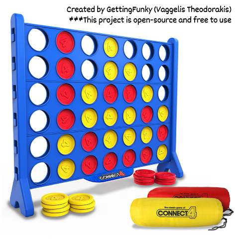

# connect-four-java
# Connect Four Java Edition

A complete Java implementation of the classic Connect Four game with modern features.



## Features
- 🕹️ Two-player turn-based gameplay
- 🔊 Sound effects for moves and game events
- 🎨 Authentic Connect Four board colors
- 🏆 Win detection in all directions (horizontal, vertical, diagonal)
- ⏲️ 3-second splash screen

## Requirements
- Java 17 or newer

## How to Run

1. **Clone the Repository:**
   ```bash
   git clone https://github.com/GettingFunky/ConnectFour.git


## Credits
- Developed by <b>GettingFunky</b> (Vaggelis Theodorakis)
- Sound effects are royalty free
- Original Connect Four concept by Howard Wexler
